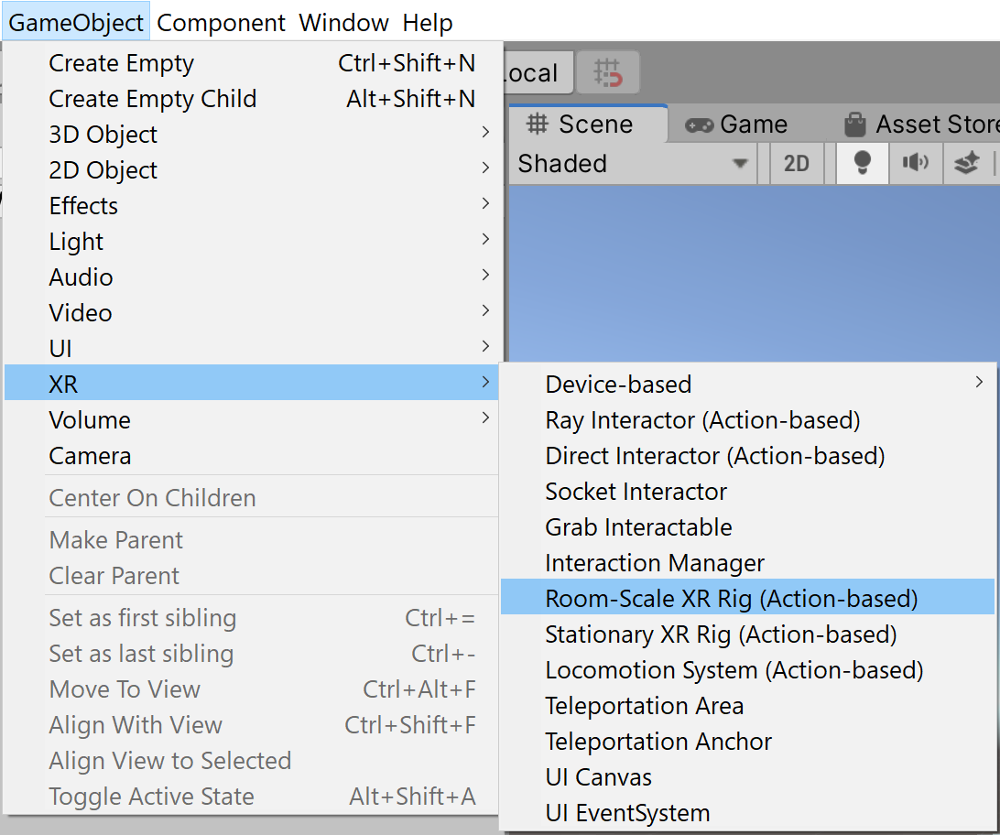
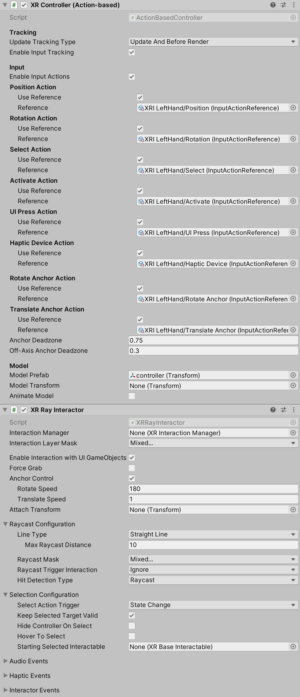

======================
XR Interaction Toolkit
======================

The XR Interaction Toolkitは, VR・ARコンテンツを作成するための高機能なコンポーネントベースのインタラクションシステムです. 
Unityの入力イベントから, 3DインタラクションとUIインタラクションを利用可能とするフレームワークを提供します. このシステムの根幹は, InteractorとInteractableコンポーネントのセットと, これら2種類のコンポーネントを管理するInteraction Managerです. また, 画像を描画したり, 独自のインタラクションイベントをフックするなど機能を拡張するヘルパーコンポーネントも含まれています. 

..
   The XR Interaction Toolkit package is a high-level, component-based, interaction system for creating VR and AR experiences. It provides a framework that makes 3D and UI interactions available from Unity input events. The core of this system is a set of base Interactor and Interactable components, and an Interaction Manager that ties these two types of components together. It also contains helper components that you can use to extend functionality for drawing visuals and hooking in your own interaction events.
..

XR Interaction Toolkit には、以下の インタラクションタスクをサポートするコンポーネントが含まれています. 

..
   XR Interaction Toolkit contains a set of components that support the following Interaction tasks:
..

   * クロスプラットフォーム対応のXRコントローラ
   * 基本的なオブジェクトに対する動作(ホバー・選択・掴む)
   * XRコントローラによる触覚フィードバック
   * 視覚的なフィードバック(tint/line rendering)により、アクティブなインタラクションを可視化
   * UI CanvasとXRコントローラの基本的なインタラクション
   * 静止モード・ルームスケールに対応したVRカメラリグ

..
   * Cross-platform XR controller input
   * Basic object hover, select and grab
   * Haptic feedback through XR controllers
   * Visual feedback (tint/line rendering) to indicate possible and active * interactions
   * Basic canvas UI interaction with XR controllers
   * A VR camera rig for handling stationary and room-scale VR experiences
..

次のARインタラクションコンポーネントを使用するためには、`AR Foundation <https://docs.unity3d.com/Manual/com.unity.xr.arfoundation.html>`_ パッケージが必要です。
また、XR Interaction Toolkitにより提供されるAR機能には次のようなものがあります。

..
  To use these AR interaction components, you must have the `AR Foundation <https://docs.unity3d.com/Manual/com.unity.xr.arfoundation.html>`_ package in your Project. The AR functionality provided by the XR Interaction Toolkit includes:
..

  * AR gesture system: スクリーンへの接触をジェスチャーに変換
  * AR interactable: 仮想オブジェクトを現実世界に配置
  * AR gesture interactor and interactables: ジェスチャーをオブジェクト操作に変換(配置・選択・変換・回転・拡大縮小)
  * AR annotations: 現実世界の配置されたARオブジェクトに関する情報をユーザーに通知

..
   * AR gesture system to map screen touches to gesture events
   * AR interactable can place virtual objects in the real world
   * AR gesture interactor and interactables to translate gestures such as place, select, translate, rotate, and scale into object manipulation
   * AR annotations to inform users about AR objects placed in the real world
..

Preview package
================

このパッケージはプレビューパッケージとして提供されています。機能やドキュメントは、リリース前に変更される可能性があります。

..
  This package is available as a preview package, so it is still in the process of becoming stable enough to release. The features and documentation in this package might change before it is ready for release.
..

Installing the package
=======================

インストールは、次のページを参考にしてください。`Package Manager documentation <https://docs.unity3d.com/Manual/upm-ui-install.html>`_.

..
  To install this package, follow the instructions in the `Package Manager documentation <https://docs.unity3d.com/Manual/upm-ui-install.html>`_.
..

本パッケージは `Input System <https://docs.unity3d.com/Packages/com.unity.inputsystem@1.0/manual/index.html>`_ に依存しています。インストールされていない場合は、Unityにより自動的にプロジェクトに追加されます。Input backendsを有効にするかどうか聞かれた場合は、**はい** をクリックしてください。

..
  This package has a dependency on `Input System <https://docs.unity3d.com/Packages/com.unity.inputsystem@1.0/manual/index.html>`_. If that package has not already been installed, Unity will automatically add it to your Project. You might see a prompt asking you to enable input backends. Click **Yes** to accept it.
..

プロジェクトでタッチやジェスチャーを使用している場合には、次の設定する必要があります。

..
  If your Project uses touches or gestures, you also need to perform the following configuration steps:
..

   1. Unityのメインメニューから、**Edit > Project Settings** を選択し、**Player** > **Other Settings** を選択します。
   2. **Active Input Handling** を **Both** に設定します。

..
   1. From Unity's main menu, go to **Edit > Project Settings**, then **select Player** > **Other Settings**.
   2. Set **Active Input Handling** to **Both**.
..

詳細は、Input Systemパッケージの `Enabling the new input backends <https://docs.unity3d.com/Packages/com.unity.inputsystem@1.0/manual/Installation.html#enabling-the-new-input-backends>`_ を参照してください。

..
  For more information, see `Enabling the new input backends <https://docs.unity3d.com/Packages/com.unity.inputsystem@1.0/manual/Installation.html#enabling-the-new-input-backends>`_ in the Input System package documentation.
..

Installing samples
=======================

The package comes with a number of samples. You can install these directly from the Package Manager (from Unity's main menu, go to **Window > Package Manager**). Select the XR Interaction Toolkit package, then click **Import** next to a sample to copy it into the current Project.

For more details about samples, see the `Samples <https://docs.unity3d.com/Packages/com.unity.xr.interaction.toolkit@1.0/manual/samples.html>`_ page.

Glossary
=======================

.. list-table::
    :widths: 15 10
    :header-rows: 1

    * - Term
      - Meaning
    * - Controller
      - A component that turns XR controller input such as a button press into interaction events like hover, or select. Also provides a way to show controller models and send haptic feedback to the controller.
    * - Object
      - Anything that the user sees or interacts with in the virtual world.
    * - Interactor
      - An object in a Scene that can select or move another object in that Scene.
    * - Interactable
      - An object in a Scene that the user can interact with (for example, grab it, press it, or throw it).
    * - Hover
      - The state where an Interactor is in a valid state to interact with an object. This differs between Ray and Direct interaction.
    * - Select
      - The state where an Interactor is currently interacting with an object.
    * - Interaction Manager
      - A manager component that handles interaction between a set of Interactors and Interactables.
    * - Gesture
      - Sequences of movements that translate into an action that manipulates an interactable.
    * - Annotation
      - A piece of content placed above (or next to) an AR object to give users information and context.
    * - Haptic
      - Sensory or visual stimuli that is sent to the user to give feedback for interaction.
   
Setup
=======

Setup through GameObject menu
------------------------------

To set up a Scene for use with the XR Interaction Toolkit, use the commands in the **GameObject** > XR menu to create Interaction GameObjects. You can drop Interactors, Interactables, and the XR Rig into the Scene from this menu.

Interaction Manager
---------------------
Every Scene that uses the XR Interaction Toolkit needs at least one Interaction Manager to facilitate interaction between Interactors and Interactables. By default, Interactors and Interactables reference the first Interaction Manager they find in the Scene if you don’t specify one. You can also break up larger Scenes with multiple Managers or turn specific ones on and off to enable sets of interaction.

Controller/Interactor
----------------------
An Interactor component controls how a GameObject interacts with other objects in the Scene. There are multiple types of Interactors. The example in the screenshot below uses a Ray Interactor, a component that uses `ray casting <https://docs.unity3d.com/ScriptReference/Physics.Raycast.html>`_ in order to find valid Interactable objects in the Scene.

